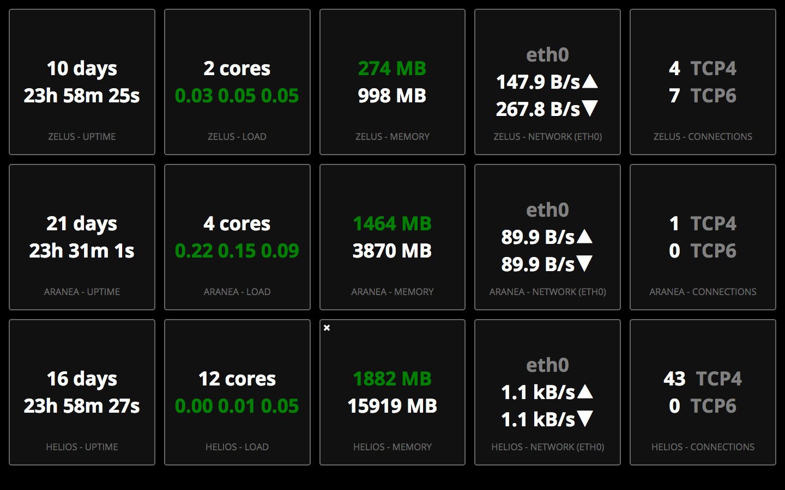

# Status Dashboard
[](https://travis-ci.org/hverr/status-dashboard)

**Status Dashboard** is a highly configurable **AngularJS** application backed by a **Go** API to show information about **multiple servers** in a dasboard style way.

 - [Features](#features)
 - [Installation](#installation)
   - [User Authentication](#user-authentication)
 - [Building](#building)
   - [Using Docker](#using-docker)
   - [Locally](#locally)
 - [Development](#development)
   - [Server](#server)
   - [Client](#client)
   - [Adding Widgets](#adding-widgets)
 - [Screenshot](#screenshot)
 - [SSL](#ssl)

## Features

 - **Efficient**
   - Machines only send information when someone has opened the dashboard.
   - No database or permanent file storage needed.
   - Only update requested information.
 - **Dynamic**
   - Add and remove widgets.
   - Reorder and resize widgets.
   - Add and remove columns and rows.
   - Can refresh as often as every second.
 - **Persistent**
   - Bookmark a layout in your browser.
 - **Linux Widgets**
   - Number of established TCP connections
   - Memory usage
   - Load average
   - Uptime
 - **Client-less widgets**
   - Current date
   - Current time

## Installation
Binaries (assets included) are available in the [release section](https://github.com/hverr/status-dashboard/releases), or can be [built manually](#building).

Releases include 32-bit and 64-bit binaries for:
 - linux
 - darwin
 - windows

### User Authentication
You can protect the dashboard using HTTP basic authentication by adding a dictionary of login, password pairs to the configuration file.

```json
{
    "users" : {
        "mylogin" : "supersecretpass"
    }
}
```

## Building
Building a binary for your platform is easiest using Docker on a Linux machine, or locally using the [Makefile](Makefile).

### Using Docker
The [Dockerfile](Dockerfile) for this repository contains everything to build the application binary. You can compile the binary for any platform supported by the Go cross compiler.

```sh
make docker # Create a Docker image named `status-dashboard`
make docker-build GOOS=yourplatform GOARCH=yourarchitecture # Create the binary
make docker-release # Make a release for some common platforms and architectures
```

### Locally
Node, NPM and Gulp are needed to build the binary. The Makefile can be used to build the binaries.

```sh
npm install -g gulp
make
./dashboard-server
./dashboard-client
```

## Development
The following dependencies are needed to build and run the application.

  - Node and NPM
  - Bower
  - Go with a working `GOPATH`

Get the project: `go get https://github.com/hverr/status-dashboard`

### Server

Build and run the server

```sh
cd $GOPATH/src/github.com/hverr/status-dashboard/server
npm install
npm install -g bower
bower install
cd $GOPATH/src/github.com/hverr/status-dashboard/server/main
go run *.go -c dev_config.json -debug
```

Point your browser to [http://localhost:8050/](http://localhost:8050)

### Client

Build and run the client(s)

```sh
cd $GOPATH/src/github.com/hverr/status-dashboard/client/main
go run *.go -c dev_config.json -debug
```

### Adding Widgets

To add widgets, you must implement several class in the following locations:

 - Go
   - Add widget model in [widgets/yourwidget.go](widgets/) *(e.g. [meminfo.go](widgets/meminfo.go))*
   - Add widget to global widget list in [widgets/widget.go](widgets/widget.go)
   - Enable the widget in your client in [dev_config.json](client/main/dev_config.json)
 - AngularJS
   - Add widget model, controller and directive in [app/widgets/yourwidget/yourwidget.js](app/widgets) *(e.g. [meminfo.js](app/widgets/meminfo/meminfo.js)*
   - Add widget template in [app/widgets/yourwidget/yourwidget.html](app/widgets) *(e.g. [meminfo.html](app/widgets/meminfo/meminfo.html)*
     - For text-based widgets you want to use the `<div text-widget>` directive and wrap the content in a `<div class="text">`
   - Add widget to the [`widgetFactory`](app/widgets/services.js)
   - Load the new JavaScript file in the [index.html](app/index.html)

## Screenshot


## SSL
You can protect the application with SSL by using a reverse proxy such as nginx. A sample configuration file can be found in [Dockerfile.nginx](Dockerfile.nginx) and [nginx.conf](examples/nginx.conf).

If you're using a self-signed certificate or CA, specify the `-ca root_ca_certificate_file` option when starting the client. An example:

```sh
make docker # Docker that will run the dashboard
make nginx # Docker that will host the nginx proxy
make docker-run-server # Run the server in a docker
make nginx-run # Run nginx proxy
go client/main/*.go -c client/main/dev_ssl_config.json -ca examples/root_ca.pem
```

You can now browse to [https://localhost:12443](https://localhost:12443)
