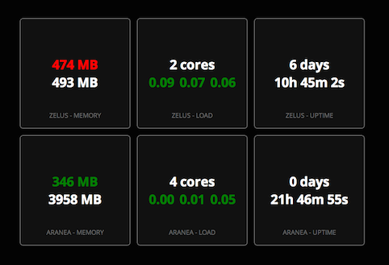

# Status Dashboard

**Status Dashboard** is a highly configurable JavaScript app to show information about **multiple servers** in a dasboard style way.

## Install

### Server Side

To get information about a system, the JavaScript queries the system for data formatted as JSON.

The [server PHP script](server/index.php) is a script that provides basic information about the system on which it is installed. Place it in your public HTTP directory and configure the JavaScript accordingly.

### Application

You can either open the `index.html` file directly in your browser, or server it through a webserver.

### Configuration

To setup the application edit the `g_configuration` variable in `main.js`. Give each system a `name`, an `updateURL` and some `widgets`.

Don't forget to setup the `refreshTimeout` value to an appropriate value in milliseconds. Don't DOS your servers!

    var g_configuration = {
    	refreshTimeout : 1000*60, /* one minute */
		systems : [
			{
				name : 'webserver',
				updateURL : 'http://status.web.example.org',
				widgets : [
					MemoryWidget,
					LoadWidget,
					UpTimeWidget
				]
			},
	        {
	            name : 'ftpserver',
	            updateURL : 'http://status.ftp.example.org',
	            widgets : [
	                MemoryWidget,
	                LoadWidget,
	                UpTimeWidget
	            ]
	        }
		]
	};
	
## Develop

Currently only widgets for **memory**, **loadavg** and **uptime** are implemented. Feel free to add your own widgets (and share them) to [`dashboard.js`](client/dashboard/dashboard.js).

First make a `Component` which manages the model object to load the JSON, then make `YourWidget`. Be sure that your widget inherits `Widget`.

Style your widget in `dashboard.css`.

Don't forget to create something that serves the JSON data!

## Credits

- [Gridster](http://gridster.net) for the grid
- [jQuery](http://jquery.com) for jQuery
- [Mockjax](https://github.com/appendto/jquery-mockjax) for mocking HTTP data when testing
- [normalize](git.io/normalize) for CSS normalization

## Warning

I had little to no experience with JavaScript when making this. And my design CSS/design skills are not really what you'd call extraordinary.